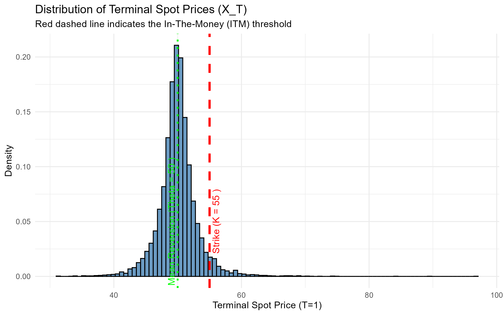
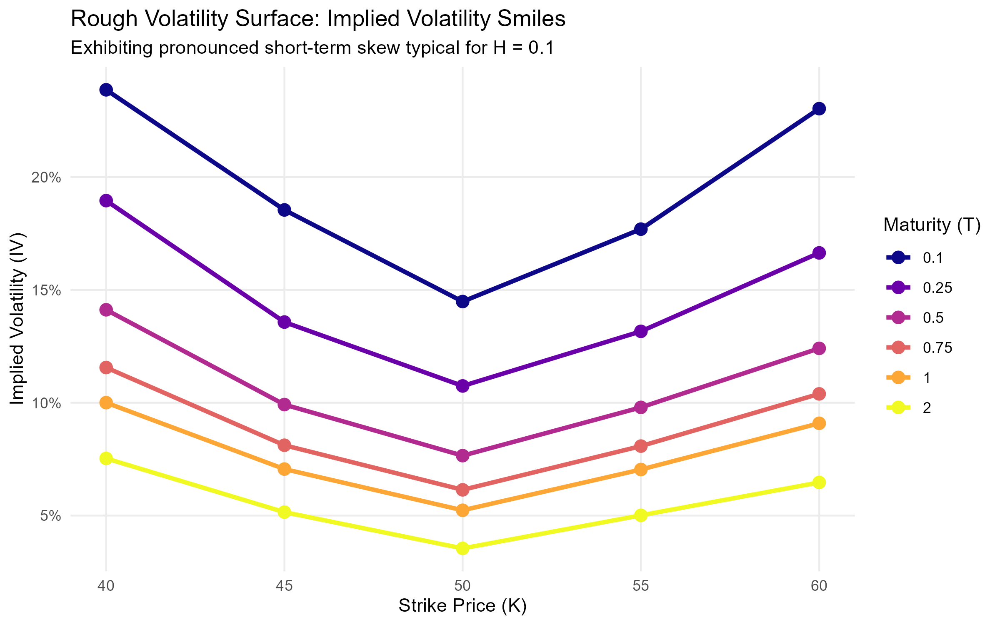

# Rough Volatility Monte Carlo Pricer for Energy Markets

## Project Objective
The goal of this project is to build a high-performance, pure C++ Monte Carlo pricing engine for derivatives in energy markets. The underlying asset (e.g., electricity spot price) is modeled using a mean-reverting Stochastic Differential Equation (SDE) coupled with a **Rough Bergomi-inspired volatility process** driven by a Fractional Brownian Motion (fBm). 

Standard volatility models fail to capture the extreme short-term spikes ("roughness") observed in energy markets. Rough volatility (H < 0.5) solves this, but simulating fBm via standard Cholesky decomposition is computationally prohibitive (O(N^3)). 

This engine solves the computational bottleneck by implementing the **Davies-Harte (Circulant Embedding) algorithm** via Discrete Fourier Transform to achieve exact simulation in O(N log N) time, fully parallelized across CPU cores using **OpenMP**.

---

## 🏗 Architecture & Code Structure
The codebase is designed with modern C++ principles (RAII, Functors, strict memory management) to ensure thread safety and scalability during parallel Monte Carlo execution.

* **`FbmGenerator` (`fbm_generator.cpp/hpp`):** Handles the mathematical heavy lifting. Pre-computes the Fourier eigenvalues upon initialization and generates exact fractional Gaussian noise increments using the Davies-Harte algorithm.
* **`SdeEngine` (`sde_engine.cpp/hpp`):** Integrates the generated fBm paths into the main Ornstein-Uhlenbeck SDE using the Euler-Maruyama discretization scheme. Optimized to avoid unnecessary vector allocations during loops.
* **`EuropeanCallPayoff` (`payoff.cpp/hpp`):** A Functor (`operator()`) representing the option payoff.
* **`MonteCarloPricer` (`monte_carlo_pricer.cpp/hpp`):** The core engine. It manages the parallelization of paths using `#pragma omp parallel for`. Instantiates thread-local RNGs to avoid race conditions and aggregates terminal prices or payoffs.

---

## 🧮 Mathematical Framework

The underlying asset follows these dynamics:

dX_t = \kappa(\theta - X_t) dt + \sqrt{V_t} X_t dW_t^{(1)}

Where:
* \kappa: Mean reversion speed.
* \theta: Long-term mean level.
* W_t^{(1)}: Standard Wiener process.

Variance is defined explicitly to capture market roughness:

V_t = V_0 \exp\left(\nu W_t^H - \frac{1}{2} \nu^2 t^{2H}\right), \quad H \in (0, 0.5)

Where W_t^H is a fractional Brownian motion (fBm) with covariance:
COV(W_t^H, W_s^H) = \frac{1}{2}\left(t^{2H} + s^{2H} - |t-s|^{2H}\right)

### The Davies-Harte Algorithm
To achieve O(N log N) complexity, we simulate the increments (fractional Gaussian noise, fGn) using circulant embedding:
1. Compute the autocovariance \gamma(k) and embed it into a symmetric circulant matrix of size 2N.
2. Compute eigenvalues via FFT.
3. Generate complex standard normal variables, scale by the eigenvalues, and apply IFFT to extract exact fGn increments.

---

## 🚀 Build & Run Instructions

This project uses CMake and requires a compiler with C++17 and OpenMP support.

**1. Clone and Configure:**
git clone https://github.com/oskarallerslev/weekend-project.git
cd weekend-project
cmake -S . -B build

**2. Build:**
cmake --build build --config Release

**3. Run:**
# Executing the grid pricer for the volatility surface
./build/Release/exec_program.exe

---

## 📊 Quantitative Results & Validation

The engine's output is validated using a production-grade R pipeline to ensure financial consistency.

### 1. Terminal Distribution
With H = 0.1, the terminal price distribution exhibits the characteristic "fat tails" of rough markets, concentrated around the mean-reversion level \theta = 50.

### 2. The Volatility Surface (Implied Volatility Smile)
The model's primary strength is its ability to reproduce the "volatility smile". By inverting the Black-Scholes formula using a Newton-Raphson solver, we observe a pronounced skew explosion at short maturities (T=0.1), which is a hallmark of Rough Volatility models.

### 3. Numerical Stability
| Metric | Value |
| :--- | :--- |
| **Expected Price (K=55, T=1)** | 0.1569 |
| **Standard Error** | 0.0118 |
| **ITM Probability** | 4.75% |
| **Cond. Payoff (Expected Shortfall)** | 3.30 |

---

## 📚 Literature & References

1. **Davies, R. B., & Harte, D. S. (1987).** *Tests for Hurst effect*. Biometrika.
2. **Gatheral, J., Jaisson, T., & Rosenbaum, M. (2018).** *Volatility is rough*. Quantitative Finance.
3. **Bayer, C., Friz, P., & Gatheral, J. (2016).** *Pricing under rough volatility*. Quantitative Finance.